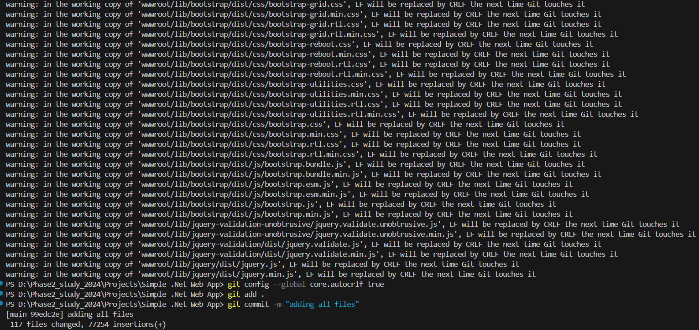

# This is Simple-.Net-Web-App
I get the error while pushing the code to github - 'wwwroot/lib/jquery/dist/jquery.min.js', LF will be replaced by CRLF the next time Git touches it

for its solution I have used the following command - 
For automatic line ending conversion (use LF in the repository and convert to CRLF when files are checked out on Windows):
git config --global core.autocrlf true
